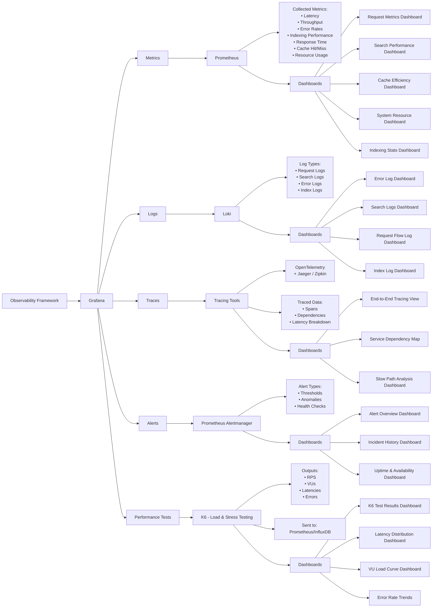

# Observability Framework for Search Engine

The following diagram illustrates the observability framework for the search engine, including metrics, logs, traces, and alerts. Each section is further broken down into specific tools and dashboards used for monitoring and analysis.

