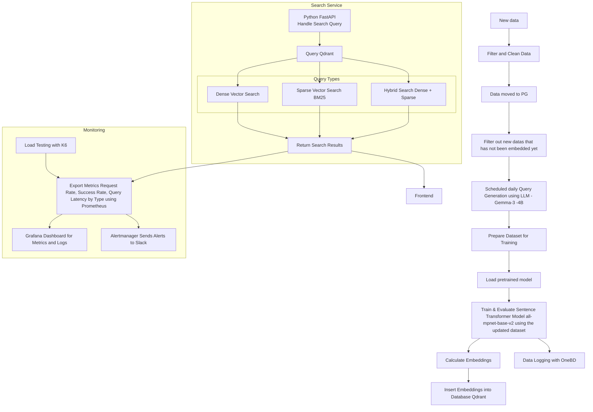

# Poridhi AI Hackathon 2025

```mermaid
flowchart TD
    A[New data] --> B[Filter and Clean Data]
    B --> FG[Data moved to PG]
    FG --> FF[Filter out new datas that has not been embedded yet]
    FF --> C[Scheduled daily Query Generation using LLM - Gemma-3 -4B]
    C --> D[Prepare Dataset for Training]
    D --> EF[Load pretrained model]
    EF --> EG[Train & Evaluate Sentence Transformer Model all-mpnet-base-v2 using the updated dataset]
    EG --> F[Calculate Embeddings]
    F --> G[Insert Embeddings into Database Qdrant]
    EG --> M[Data Logging with OneBD]

    subgraph Search Service
        H[Python FastAPI<br>Handle Search Query]
        H --> I[Query Qdrant]
        
        subgraph Query Types
            I1[Dense Vector Search]
            I2[Sparse Vector Search BM25]
            I3[Hybrid Search Dense + Sparse]
        end

        I --> I1
        I --> I2
        I --> I3

        I1 --> J[Return Search Results]
        I2 --> J
        I3 --> J
    end

    subgraph Monitoring
        K[Export Metrics Request Rate, Success Rate, Query Latency by Type using Prometheus]
        L[Load Testing with K6]
      
        N[Alertmanager Sends Alerts to Slack]
        O[Grafana Dashboard for Metrics and Logs]
    end

    J --> K
    K --> O
    K --> N
    L --> K

    J --> FRONTEND[Frontend]
   
```
